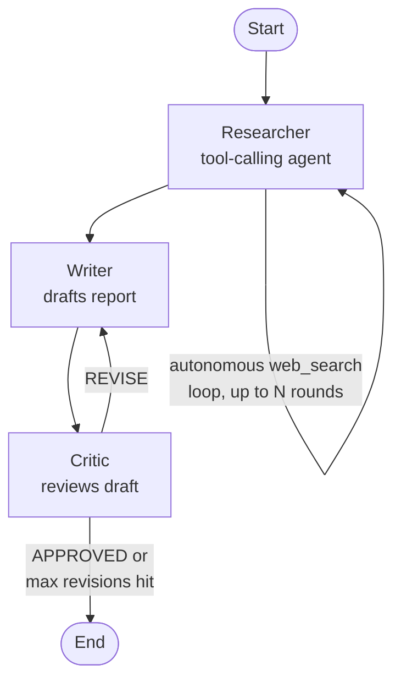

# Multi-Agent Research Assistant

A LangGraph-coordinated research pipeline with three roles: an agentic Researcher
that can autonomously decide when to search the web, a Writer that drafts the
report, and a Critic that gates quality — sending drafts back for revision until
they're approved or a revision cap is hit.

## Architecture

**Researcher** is a true tool-calling agent: it decides for itself whether the
information it has is sufficient, or whether it needs to call the `web_search`
tool (Tavily) again — up to a safety cap of `MAX_ITERATIONS`. This isn't a fixed
"always search once" step; the LLM inspects its own message history each round
and chooses.

**Writer** and **Critic** are structured LLM calls, not autonomous agents —
each runs a single fixed prompt against the shared graph state. The **Critic**
still provides the system's dynamic behavior: it outputs a structured
`APPROVED` / `REVISE` verdict that drives a LangGraph conditional edge, looping
back to the Writer with specific feedback until the draft passes or hits
`MAX_REVISIONS`.

So this is best described as a **hybrid architecture** — one genuinely agentic
node (Researcher) plus two structured, state-driven decision nodes (Writer,
Critic) — coordinated through a LangGraph state machine with a real revise loop,
not a linear pipeline.

## Tech Stack

| Component | Technology |
|---|---|
| Orchestration | LangGraph (StateGraph, conditional edges) |
| LLM | Google Gemini 3.5 Flash-Lite (free tier) |
| Tool use | Tavily Search API (Researcher's `web_search` tool) |
| UI | Gradio |
| Env management | python-dotenv |

## How to Run

1. Clone the repo and create a virtual environment
2. Install dependencies:
`pip install langgraph langchain-core langchain-google-genai langchain-tavily python-dotenv gradio`
3. Copy `.env.example` to `.env` and fill in your own keys:
   - `RESEARCHER_API_KEY`, `WRITER_API_KEY`, `CRITIC_API_KEY` — free Gemini API keys from [Google AI Studio](https://aistudio.google.com/apikey)
   - `TAVILY_API_KEY` — free key from [Tavily](https://tavily.com)
4. Open `multi_agent_research_assistant.ipynb` in VS Code (or Jupyter) and run all cells

## Design Notes

- **Why separate API keys per role**: Gemini's free tier rate limits are shared
  per-project-per-model, not per-key. Splitting Researcher/Writer/Critic onto
  separate keys avoids one role starving another of quota.
- **Why a revision cap**: without `MAX_REVISIONS`, a Critic that never approves
  would loop indefinitely. The cap is a deliberate safety net, not a tuning knob.
- **Why the Researcher loop has its own cap**: same reasoning — `MAX_ITERATIONS`
  bounds how many times the Researcher can call `web_search` before being forced
  to answer with what it has.